주식회사 무니스 (Munice Inc.) | 2026년 3월 13일

# 3월 13일 '세계 수면의 날', Renight(리나잇)이 일본인 수면 만족도 분석 리포트를 발표

*일본인 평균 수면시간 6시간 38분 — 전체 유저 대비 21분 짧고, 만족도도 0.53점 낮아*

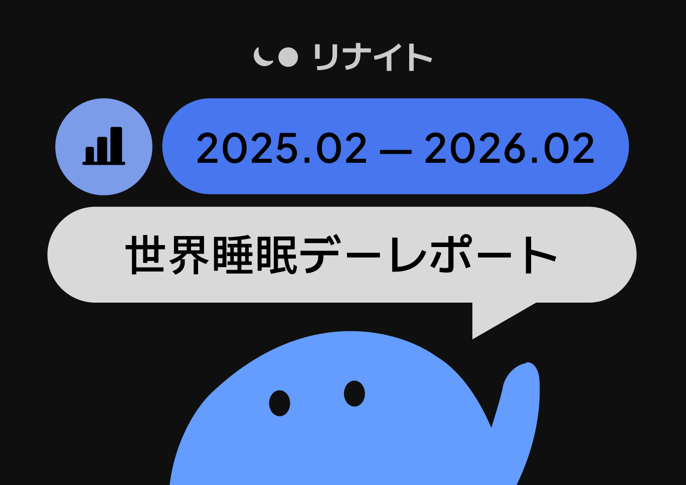

AI와 뇌과학 기반 초개인맞춤형 수면 솔루션 **Renight**(리나잇, 개발사: 주식회사 무니스)이 3월 13일 세계 수면의 날(World Sleep Day)을 맞아 일본인 사용자의 수면 만족도 분석 리포트를 발표했다.

Renight은 전 세계 160만 유저가 사용하는 구독형 수면 앱으로, 일본 앱스토어 헬스케어 카테고리 1위, 151개국 오늘의 앱에 선정된 바 있다. 사용자의 하루 상태, 생활 패턴, 수면 중 데이터를 종합 분석하여 매일 밤 최적화된 수면 환경을 제공한다.

이번 리포트는 2025년 2월부터 2026년 2월까지 약 1년간 Renight에 축적된 실제 수면 데이터를 분석한 결과다. 설문 조사가 아니라 **매일 밤 사용자가 직접 기록한 실측 데이터**를 기반으로 하며, 수면시간·취침시각·기상시각·수면 전 활동·감정 상태와 수면 만족도의 관계를 교차 분석했다.

### 조사 하이라이트

- **일본인 평균 수면시간 6시간 38분**, Renight 전체 유저 평균 대비 21분 짧다
- **수면 만족도 6.67점(10점 만점)**, 전체 유저 대비 0.53점 낮다
- **7시간이 만족도의 분기점** — 6시간대에서 7시간으로 넘어가는 순간, 만족도가 급상승한다
- **행복한 밤 vs 우울한 밤**, 만족도 차이 0.81점 — 수면시간 2시간 차이와 동일한 효과

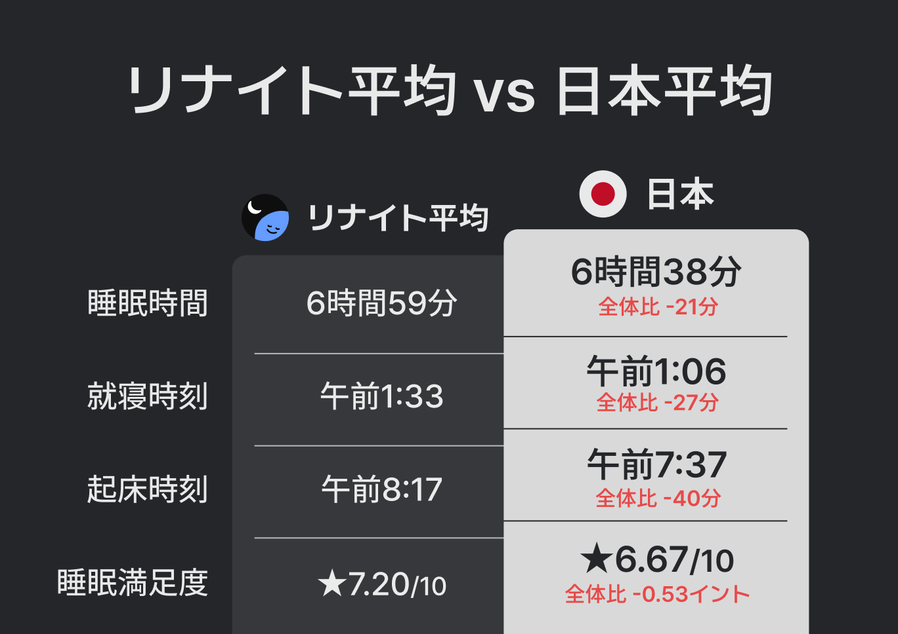

## 1. 일본인 수면의 현주소 — Renight 전체 유저 대비 비교

일본인 사용자의 수면 데이터를 일본 외 유저 평균과 비교했다. 수면시간, 취침·기상 시각, 수면 만족도 — 네 가지 지표 모두에서 일본인의 수치가 낮았다.

일본인은 일본 외 유저에 비해 27분 일찍 잠들고, 40분 더 일찍 일어난다. 수면시간은 21분 짧고, 수면 만족도도 0.53점 낮다.

## 2. "7시간의 벽" — 수면시간과 만족도의 관계

수면시간을 30분 단위로 나누어 만족도를 비교한 결과, **7시간이 명확한 분기점**으로 나타났다.

- 수면시간이 7시간을 넘기면 만족도가 일본인 전체 평균(6.67점)을 초과한다
- 6시간 30분에서 7시간으로 넘어가는 구간에서 만족도가 **6.67 → 6.83**으로 급상승
- 이 30분의 상승폭(+0.16)은 다른 어떤 30분 구간보다 **약 2배 큰 효과**다

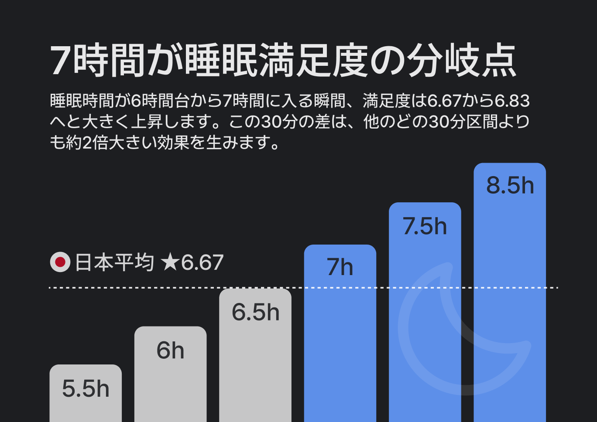

## 3. 취침 시각 — 0시 전에 잠들면 만족도가 높다

취침 시각을 1시간 단위로 나누어 비교한 결과, **자정 이전에 잠드는 경우 만족도가 가장 높았다.**

- 21시 취침 시 만족도 6.86, 22시 6.84, 23시 6.80
- 23시에서 0시로 넘어가는 구간에서 만족도 감소폭이 가장 크다(-0.12)
- 취침 시각이 늦어질수록 만족도는 일관되게 하락한다

일본인 평균 취침 시각은 오전 1:06. 1시간만 앞당겨도 만족도 향상을 기대할 수 있다.

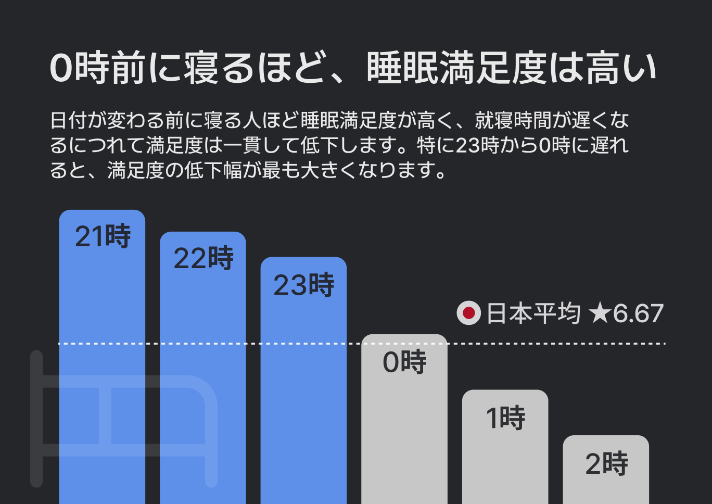

## 4. 기상 시각 — 늦게 일어날수록 만족도는 높다

기상 시각별 만족도를 비교한 결과, 대체로 늦게 일어날수록 만족도가 높은 경향을 보였다.

- 7시 → 8시로 기상을 늦출 때(+0.14)와 8시 → 9시(+0.13)에서 가장 큰 상승폭
- 일본인 과반수가 6~7시에 기상하지만, 이 시간대의 만족도(6.61~6.62)는 평균 이하

이는 수면시간이 길어지면서 자연스럽게 나타나는 결과로 해석된다.

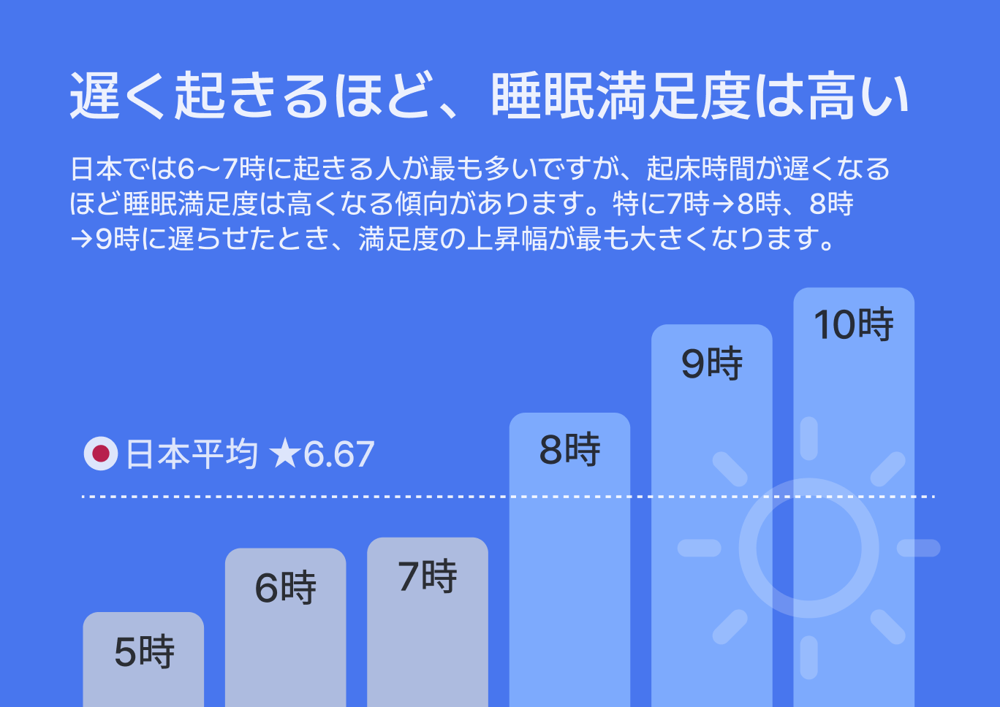

## 5. 취침 전 활동 — 운동과 산책이 수면의 질을 높인다

Renight 사용자가 잠들기 전 기록한 15가지 활동별 수면 만족도를 분석했다.

**만족도가 높은 활동 (상위)**

- **운동**: 6.95 (+0.28)
- **산책**: 6.93 (+0.27)
- **스트레칭**: 6.82 (+0.16)
- **일기쓰기**: 6.82 (+0.16)

**만족도가 낮은 활동 (하위)**

- TV 시청: 6.62 (-0.05)
- 커피: 6.58 (-0.09)
- 음주: 6.46 (-0.21)
- 니코틴: 6.45 (-0.21)

신체 활동이 수면 만족도와 가장 강한 양의 상관관계를 보였다. 반면 음주와 니코틴은 만족도 최하위로, 평균 대비 0.21점 낮다.

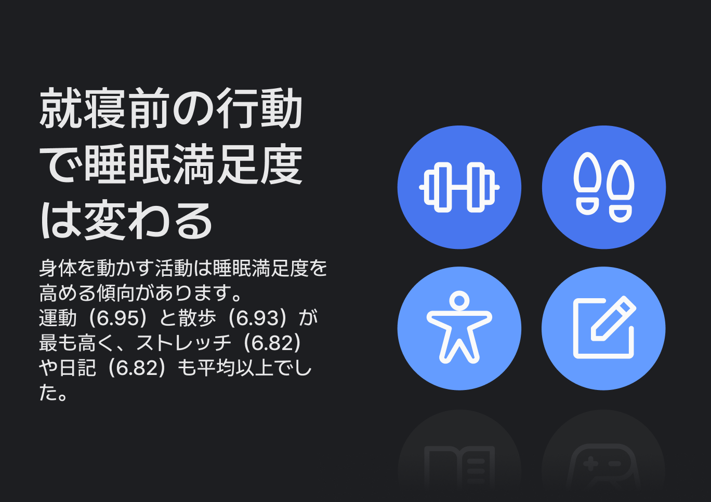

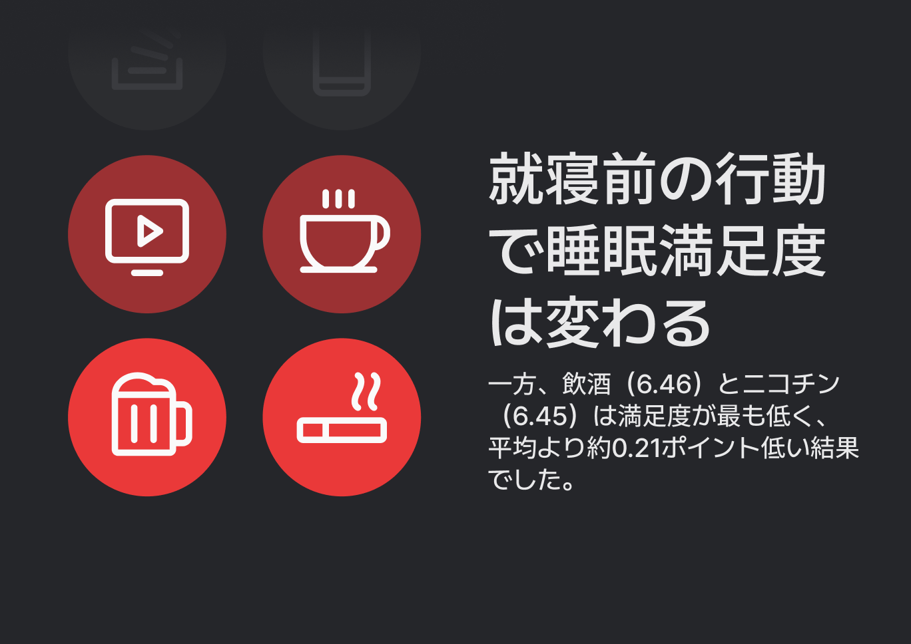

## 6. 술의 역설 — 더 오래 자지만, 더 나쁘게 잔다

음주와 수면의 관계에서 흥미로운 역설이 드러났다.

음주 후 수면시간은 평균보다 **+12분** 길다. 하지만 수면 만족도는 **6.46**으로, 전체 평균(6.67)보다 **0.21점 낮다**. 술은 잠을 빨리 오게 하지만, 수면의 질을 떨어뜨린다. 더 오래 자도 개운하지 않은 이유가 여기에 있다.

참고로 카페인은 수면시간을 직접 줄이고(-15분), 니코틴 사용자는 평균보다 늦은 오전 1:30에 취침하며 만족도도 6.45로 최하위다.

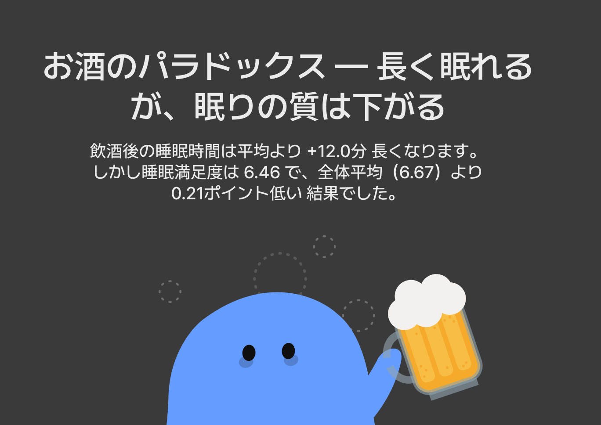

## 7. 감정 — 행복한 밤과 우울한 밤의 차이

잠들기 전 감정 상태별 수면 만족도를 분석한 결과, **감정이 수면의 질에 미치는 영향은 수면시간 못지않게 컸다.**

**긍정적 감정 (높은 만족도)**

- **행복**: 7.09
- **기쁨**: 7.08
- **만족**: 7.05
- **설렘**: 7.00

**부정적 감정 (낮은 만족도)**

- 긴장: 6.49
- 불안: 6.44
- 슬픔: 6.43
- 스트레스: 6.41
- **우울: 6.28**

행복한 밤(7.09)과 우울한 밤(6.28)의 만족도 차이는 **0.81점**. 이는 5시간 수면과 7시간 수면의 만족도 차이에 맞먹는 수준이다. 잘 자기 위해서는 잘 깨어 있는 것, 즉 낮 동안의 심리적 상태와 생활 습관도 중요하다.

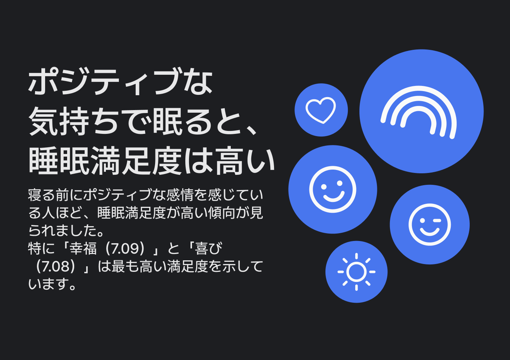

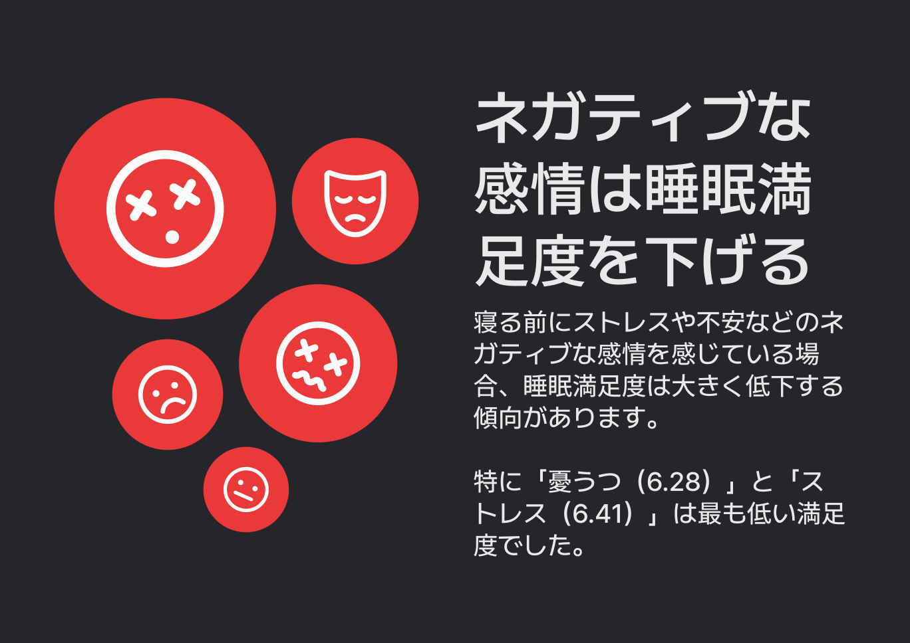

## 8. 주중 vs 주말 — 주말 보상 수면의 함정

요일별 수면 패턴을 비교한 결과, 주말에 더 오래 자고 만족도도 높았다.

주중 평균 수면시간은 6시간 34분(만족도 6.62), 주말은 6시간 51분(만족도 6.82)으로 주말에 17분 더 길고 만족도도 0.21점 높다.

다만 주말에는 취침과 기상 시각이 모두 뒤로 이동한다. 주중에 못 잔 만큼 주말에 만회하려 하지만, 더 늦게 자고 늦게 일어나는 것은 우리 몸에 매주 시차를 겪는 것 같은 스트레스를 준다. 취침 시각은 최대한 일정하게, 기상 시각도 너무 늦지 않게 유지하는 것이 다음 주의 컨디션을 위한 선택이다.

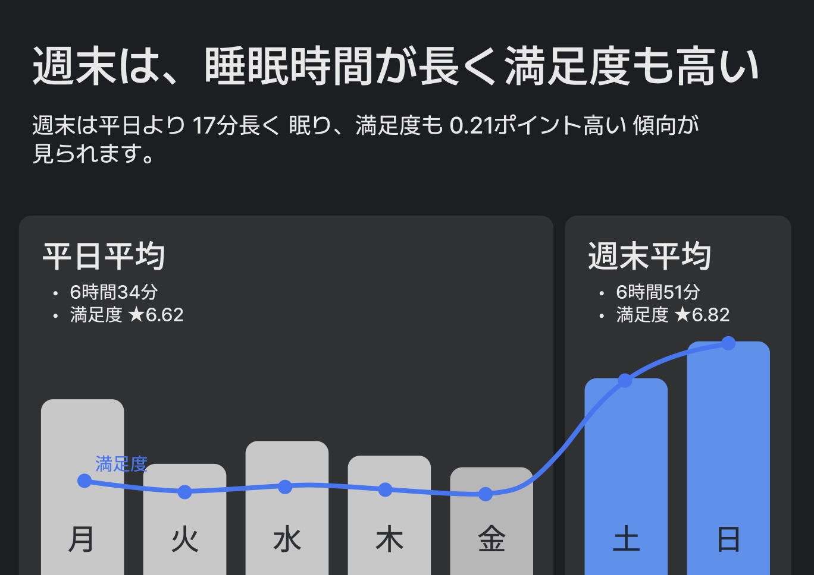

## 수면 만족도를 높이는 7가지 방법

Renight 데이터에서 확인된, 수면 만족도 향상에 실질적 효과가 있는 방법을 정리했다.

**1) 7시간 이상 자기**
7시간 수면자 만족도 6.83 vs 6시간대 6.58. 현재 일본인 평균 6시간 38분. 취침을 22분만 앞당기면 7시간을 확보할 수 있다.

**2) 밤 11시(23시) 이전에 잠들기**
22시 취침 만족도 6.84 vs 0시 이후 6.68. 취침 시각이 1시간 늦어질 때마다 만족도 약 0.10점 하락. 일본인 평균(1:06)에서 1시간만 앞당겨 보자.

**3) 저녁에 가벼운 운동이나 산책하기**
운동 6.95(+0.28) / 산책 6.93(+0.27) — 만족도 1, 2위. 20~30분의 가벼운 운동이면 충분하다.

**4) 스트레칭이나 일기쓰기로 마무리하기**
스트레칭 6.82(+0.16) / 일기쓰기 6.82(+0.16). 취침 전 5~10분이면 된다. 독서(6.79)도 좋은 선택이다.

**5) 취침 전 음주 줄이기**
음주 6.46(-0.21) — 수면 +12분이지만 만족도 최하위. 술은 수면시간을 늘리지만 질을 떨어뜨린다. 주 3일만 음주 없이 취침해 보자.

**6) 카페인과 니코틴 줄이기**
카페인 -15분 / 니코틴 만족도 -0.21. 오후 2시 이후 카페인 차단, 취침 2시간 전 흡연 중단을 시도해 보자.

**7) 긍정적인 마음으로 잠들기**
행복한 밤 7.09 vs 우울한 밤 6.28 → 0.81점 차이. 감정 상태가 수면 만족도에 미치는 영향은 수면시간 2시간 차이와 동일. 취침 전 감사한 일 3가지를 떠올려 보자.

**가장 효과적인 조합:** 22시 이전 취침 + 7시간 이상 수면 + 저녁 산책/운동 + 긍정적 감정 → 예상 만족도 **7.2점 이상** (현재 일본 평균 6.67 대비 +0.53점)

## Renight 소개

**Renight**(리나잇)은 AI와 뇌과학을 기반으로 한 초개인맞춤형 수면 솔루션이다. 사용자의 하루 상태, 생활 패턴, 수면 중 데이터를 종합 분석하여 매일 밤 최적화된 수면 환경을 제공하는 구독형 수면 앱이다.

- 전 세계 유저 160만
- 일본 앱스토어 헬스케어 1위
- 151개국 오늘의 앱 선정
- 깊은 수면 2배 상승 검증

Renight은 단순히 잠을 돕는 것이 아니라, 밤을 회복의 시간으로 다시 정의한다.

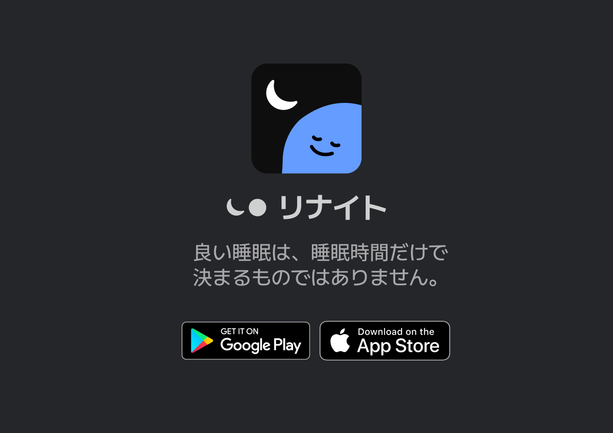

App Store: https://apps.apple.com/app/renight
Google Play: https://play.google.com/store/apps/details?id=com.munice.renight

## 분석 개요

- 데이터 기간: 2025년 2월 ~ 2026년 2월
- 분석 대상: Renight 일본인 사용자 수면 데이터
- 분석 방법: 수면시간·시각·활동·감정별 만족도 교차 분석
- 만족도 지표: 기상 직후 사용자가 1~10점으로 자가 평가

### 참고 문헌

1. Kohyama, J. (2021). Which is more important for health: sleep quantity or sleep quality?. *Children*, *8*(7), 542.
2. Ahrensberg, H., Christensen, A. I., Andersen, S., & Petersen, C. B. (2025). Comparison of self-reported sleep sufficiency and accelerometer-measured sleep duration in relation to mental health, physical health, and life satisfaction. *Frontiers in sleep*, *4*, 1661250.
3. Hirshkowitz, M., Whiton, K., Albert, S. M., Alessi, C., Bruni, O., DonCarlos, L. et al. (2015). National Sleep Foundation's sleep time duration recommendations: methodology and results summary. *Sleep health*, *1*(1), 40-43.
4. Protogerou, C., Gladwell, V. F., & Martin, C. R. (2024). Conceptualizing sleep satisfaction: a rapid review. *Behavioral Sciences*, *14*(10), 942.
5. Tonetti, L., Andreose, A., Bacaro, V., Grimaldi, M., Natale, V., & Crocetti, E. (2022). Different effects of social jetlag and weekend catch-up sleep on well-being of adolescents according to the actual sleep duration. *International Journal of Environmental Research and Public Health*, *20*(1), 574.
6. Hsiao, F. C., Huang, Y. H., & Yang, C. M. (2025). The sleep paradox: The effect of weekend catch-up sleep on homeostasis and circadian misalignment. *Neuroscience & Biobehavioral Reviews*, *175*, 106231.

**본 보도자료에 관한 문의처**
주식회사 뮤니스 (Munice Inc.)
